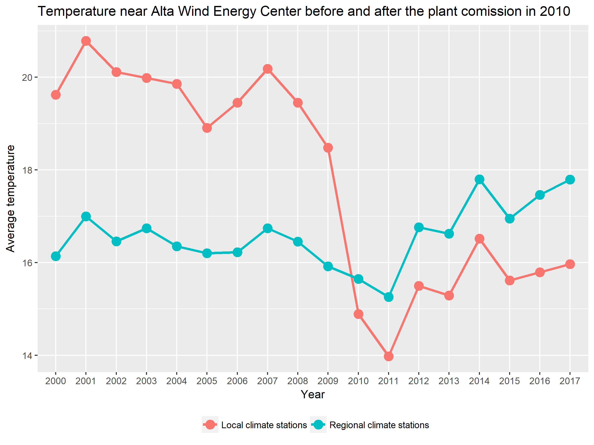

# Project The Effect of Renewable Energy sources on micro climates

### Introduction

Global energy demand is increasing, making renewable energy sources critical to future sustainable power supply. Land-based wind and solar electricity generation plans are rapidly expanding. 75% of wind power plants and 95% of solar plants are built and deployed only last 10%. These plants are assumed to have little effect on the environment, although the understanding of their operational effects on local ecosystems is limited.
Wind turbines and photovoltaic panels can significantly change local ground-level climate by a magnitude that could affect the fundamental atmosphere-plant-soil processes. We believe that understanding the possible effects is crucial to reducing uncertainty of the true renewable energy cost and to maximize beneficial effects. This project is aiming to detect and predict the effects of the renewable energy sources, as well as suggest strategies to reduce the negative impact by studying multiple cases. I will be looking into renewable energy power plants around the world, and correlate its location and power outputs with the data on climate, atmospheric conditions, local weather and vegetation, air quality and pollution levels. The resutls will be benefitical for the nation-wide planning of locating renewable energy plants, it will also be important for individual that are installing renewable energy generators on their properties.

### Data sourses

* _GSOD database_ - daily global weather measurements accumulated in an integrated station history database. The data is accessible through R package 'GSODR'.
* _Google maps_ - satellite earth surface image data, accessible through R package 'ggmap'.
* _Monthly Electric Generator Inventory_ - data on current status of generating units at electric power plants with 1 MW or greated power capacity. Data provided by U.S. Energy Information Administration and downloaded online.

### Exploratory study of local climate for Alta Wind Energy Center wind farm

For the exploratory study I have searched and determined the example of the wind power plant, and demostrated the its effect on the local climate. As the example I selected the Alta Wind energy center (AWEC). It is located in Tehachapi Pass in Kern county, California. The AWEC was first deployed in 2010 and as of 2013, it is the largest wind farm in the United States, with a combined installed capacity of 1,547 MW. It is also the third largest wind farm in the world. The location and the power capacity are fetched from the Electric Generator Inventory.

To access the microclimate in the vicinity of the power plant, I pulled from the GSOD database the stations in the vicinity to the AWEC in two categories: stations within 20-km-radius from the plant and stations within 50-km-radius but beyond the 20-km-radius. The first group is denoted as "Local climate stations" and is suppose to represent the trends in the climate immideately affected by the AWEC. The second group (20-50 km radius) is called "Regional climage stations" that are not affected directly by wind turbines, but represent the general trends of climate changes in the area. The map with locations is displayed below.

 

For exploratory purposes I estimated the average annual temperature during 2000-2018 detected by local stations and regional stations. The data is displayed on the graph below. The regional and local annual temperature readings correlate well from year to year, which confirms both parameters follow similar trends of climate change. But in 2010-2011 there is a shart drop in average temperatures for local stations, which the regional stations kept at the same level. The effect is very well defined and can be attributed to the deployment of the AWEC.

 
